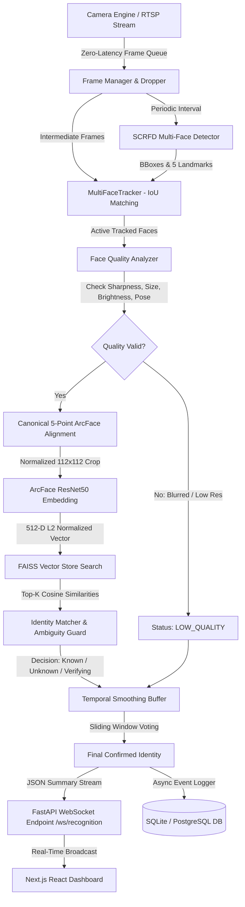

# System Architecture: Multi-Face Detection, Tracking & ArcFace Recognition

## 1. High-Level Architectural Flowchart

## 2. Decoupled Modular Subsystems

1. **Hardware & Execution Layer**
   - Automatically detects CPU threads, physical cores, RAM, and NVIDIA GPU/CUDA.
   - Selects `CUDAExecutionProvider` when available, seamlessly falling back to `CPUExecutionProvider` without crashing.

2. **Camera Subsystem (`backend/app/services/camera_service.py`)**
   - Independent background capture thread reading frames via OpenCV DirectShow/V4L2.
   - Non-blocking latest-frame atomic buffer: slow inference never causes camera buffer latency or video delay.
   - Resilient auto-reconnect engine with exponential backoff.

3. **Multi-Face Detection (`backend/app/ml/detector.py`)**
   - SCRFD (Sample and Computation Redistribution for Efficient Face Detection) ResNet-10G / 500M ONNX model.
   - Simultaneously outputs bounding boxes, detection confidences, and 5 facial keypoints (eyes, nose, mouth corners).
   - Multi-scale anchor pyramids (stride 8, 16, 32) capable of detecting small faces in classroom backgrounds.

4. **Face Quality Assurance (`backend/app/services/quality_service.py`)**
   - Rejects faces smaller than 60px.
   - Evaluates motion blur using Laplacian variance ($\sigma^2_{\text{Laplacian}} \ge 50.0$).
   - Brightness check ($40 \le I_{\text{mean}} \le 220$).
   - 3D pose estimation from 5 landmarks (Yaw, Pitch, Roll) ensuring faces turned away ($>35^\circ$) are not falsely recognized.

5. **Face Alignment (`backend/app/ml/alignment.py`)**
   - Uses 2D similarity transformation (`cv2.estimateAffinePartial2D`) to map detected 5 landmarks to canonical ArcFace template coordinates.
   - Used identically in registration and live inference to ensure embedding consistency.

6. **ArcFace Embedding & Feature Normalization (`backend/app/ml/recognizer.py`)**
   - InsightFace ArcFace ResNet50 deep feature extractor.
   - Outputs 512-dimensional vectors with unit L2 norm ($||\mathbf{v}||_2 = 1.0$), transforming cosine similarity into inner products.

7. **Vector Indexing & Nearest Neighbor Search (`backend/app/ml/vector_store.py`)**
   - FAISS `IndexFlatIP` performing exact cosine distance queries in sub-millisecond latency (< 0.1ms for 100+ candidates).
   - Atomic disk synchronization with persistent metadata store.

8. **Identity Verification & Ambiguity Protection (`backend/app/services/matching_service.py`)**
   - Aggregates multiple face samples per student using weighted top-sample scoring.
   - Ambiguity protection: if top-2 candidates from different identities are within 0.03 margin, identity is withheld for verification.
   - Explicit `UNKNOWN` decision when similarity is below calibrated threshold (0.40).

9. **Multi-Face Tracking & Temporal Smoothing (`backend/app/ml/tracker.py` & `tracking_service.py`)**
   - IoU-based multi-face tracker assigns consistent track IDs across frames.
   - Temporal voting sliding window (8 frames) requires 60% agreement before promoting identity to `KNOWN`, preventing flickering.
